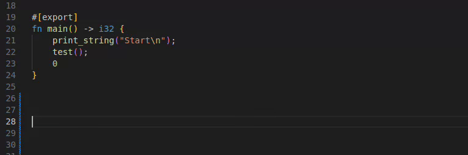

# AnyDSL - Artic Language Server

Visual Studio Code Language support for AnyDSL's Impala programming language.\
The language server is based on a fork of the Artic compiler frontend and continuously compiles your code as you write it.

Note: The language server is currently in an alpha stage. Please report any technical or non-technical problems.



## Features

- Syntax highlighting
- Diagnostics (errors, warnings, hints)
- Go to definition
- Find references
- Rename action
- Code completion (available symbols)
- Code snippets (for loops, function declarations, ...)

## Limitations

- Only supports x86_64 Linux
- Does not support the legacy Impala syntax
- Workspace configuration file must be in root workspace folder (TODO)


## Usage

1. [Install extension](#installation)
2. Open a `.impala` or `.art` file in VS Code.
    - The extension will automatically start the Artic language server.
    - You will see syntax highlighting and LSP features such as diagnostics.
3. Create a [workspace configuration file](#workspace-configuration-file) `artic.json`
4. Create a [global configuration file](#global-configuration-file) `artic-global.json`

## Installation

1. Download the latest release of the extension [here](https://github.com/DFOP-HD/vscode-artic/releases).

2. Install the extension using one of these options:
    - a) Open the command palette in VS Code with `Ctrl+Shift+P`, select `Extensions: Install from VSIX...` and then select the downloaded `.vsix` file.
    - b) Run this command in the terminal: `code --install-extension artic-language-server-<version>.vsix`

## Workspace Configuration File

Create a workspace configuration file `artic.json` at the root of your workspace.

This configuration file tells the language server which files are associated with your project and should therefore be compiled together.
This is essential to give you good diagnostics and 'go to definition' functionality

Example:

```json
{
    // configuration header (includes version in case the config file format changes in the future)
    "artic-config": "1.0",

    // all projects defined in this workspace
    "projects": [ 
        {
            "name": "my project",     // name of the project (must be unique)
            "folder": "",             // root folder of the project (optional, defaults to location of the configuration file)
            "dependencies": [
                "runtime",     // include all files of the project 'runtime'     (and it's dependencies)
                "artic-utils"  // include all files of the project 'artic-utils' (and it's dependencies)
            ],
            "files": [
                "/home/gruen/absolute.art", // include single file (absolute path)
                "relative.art",             // include single file (relative to project folder)
                "!src/exclude.impala",      // exclude file(s) with '!' prefix
                "wi?d*rd.art",              // wildcard '?' substitute a single character, '*' substitutes multiple characters
                "**/*.impala"               // include files recursively with '**'
            ]
        }
    ],

    // recursively include projects from other configuration files (paths do not support wildcards)
    "include": [
        "../anydsl/runtime/artic.json",       // here: defines project runtime
        "../anydsl/artic-utils/artic.json",   // here: defines project artic-utils

        // include projects from global config 'artic-global.json' (path specified in extension settings). 
        // also active even when "<global>" is not explicitly specified
        "<global>",                           

        // mark include as optional with '?' postfix 
        // (useful as a fallback for projects assumed to be included by 'artic-global.json') 
        "~/repos/anydsl/optional/artic.json?" 
    ],
    
    // default project (usually only defined in 'artic-global.json'):
    // When you open a file that does not belong to any known project 
    // (i.e. projects that are defined or recursively included in your global or workspace config),
    // the language server will compile that file along with the files of the default project
    "default-project": {
        "name": "default project",
        "dependencies": [
            "runtime" // usually includes default dependencies like this runtime library
        ],
        "files": []
    },
}
```

## Global Configuration File
Create a global configuration file `artic-global.json` (e.g. in `HOME`) and specify the path to the file in the extension settings

Example:

```json
{
    "artic-config": "1.0",

    // the global configuration file typically includes a default project definition
    "default-project": {
        "name": "default project",
        "dependencies": [
            "runtime"
        ],
        "files": []
    },

    // defined projects are globally available
    "projects": [],

    // included projects are globally available
    "include": [
        "repos/anydsl/runtime/artic.json" // here: defines project 'runtime'
    ]
}
```

## Hints
The language server will also provide information and diagnostics for your configuration files.

Example:


# Development

## Repository

```js
vscode-artic
| artic-lsp                   // Language server - fork of Artic (c++)
| src
| | extension.ts              // Language client (vscode)
| syntaxes
| | artic.tmGrammar.json      // TextMate grammar for syntax highlighting
| language-configuration.json // Brackets and indentation rules
|
| build-lsp.sh                // builds artic-lsp
| build-lsp.sh                // builds artic-lsp
| package.sh                  // builds artic-lsp and extension, packages the extension
| publish.sh                  // builds and packages everything, publishes a new release (internal)
|
| LICENSE.md
| README.md
```

## Build Requirements

- CMake
- Ninja¹ 
- Clang²
- Node.js >= 20 (installed with nvm)
> ¹ You can also use another generator, but ninja is used by default in the setup script `build.sh`.

> ² gcc is currently unsupported as it isn't compatilble with lsp-framework, other compilers were not tested.

> As, this extension only supports x86_64 Linux, development has only be tested on this platform.

## Checkout the repository

Clone the repository
```bash
# clone recursively using https
git clone https://github.com/DFOP-HD/vscode-artic.git --recursive
# or ssh
git clone git@github.com:DFOP-HD/vscode-artic.git --recursive
```
Note: if you forgot to clone recursively, you can run this after cloning
```bash
git submodule init
git submodule update --recursive
```

## Building

Configure and build `artic-lsp` with

```bash
cd artic-lsp && ./build.sh
```

### Build and Package the Extension

To build Artic and package the VS Code extension as a `.vsix` file:

```bash
./package.sh
```

If you also want to immediately install the extension, use:

```bash
./package.sh install
```

### Build and start Extension Development Host

The easiest way to get started developing is to open the project in VSCode and press `F5`.
This will open a new VSCode window with the extension installed.