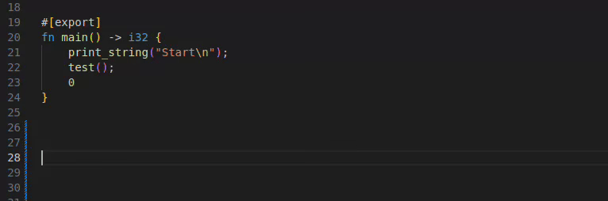
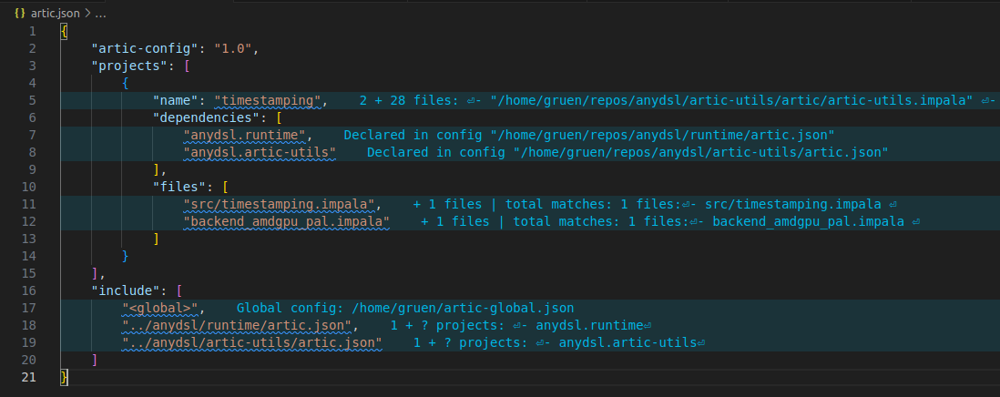

# AnyDSL - Artic Language Server

Visual Studio Code language support for [AnyDSL](https://anydsl.github.io/)'s Artic language.

The server is built on a fork of the Artic compiler frontend and recompiles your project as you
type, so diagnostics and navigation come from the real type checker rather than from a heuristic
parser.

Note: The language server is currently in an alpha stage. Please report any technical or
non-technical problems.



## Features

- Diagnostics (errors, warnings and hints) from the real lexer, parser, name binder and type checker
- Hover: declaration signature and inferred type
- Go to definition and find references
- Rename
- Code completion for the symbols in scope
- Inlay hints for inferred types
- Semantic highlighting on top of the TextMate grammar
- Snippets for loops, function declarations and other common constructs
- Diagnostics for the `artic.json` configuration file itself

## Limitations

- x86_64 only
- The legacy Impala syntax is not supported, even in `.impala` files
- The workspace configuration file must be in the root workspace folder
- `artic.json` is plain JSON: comments and trailing commas are rejected
- Releases contain the Linux and Windows server binaries; on any other platform,
  [build the server](#building) and point `artic.serverPath` at it.

## Usage

1. [Install the extension](#installation).
2. Open a `.art` or `.impala` file. The extension starts the language server automatically.
3. Create a [workspace configuration file](#workspace-configuration-file) so the server knows which
   files belong together. Without one, a file is compiled on its own and everything it expects from
   another file is reported as unknown.

## Installation

1. Download the latest release [from GitHub](https://github.com/DFOP-HD/vscode-artic/releases).
2. Install the `.vsix`:
    - VS Code: `Ctrl+Shift+P`, then `Extensions: Install from VSIX...`, or run
      `code --install-extension artic-language-server-<version>.vsix`
    - Cursor: `cursor --install-extension artic-language-server-<version>.vsix`

The extension is not published to the Visual Studio Marketplace or to Open VSX, so it cannot be
installed from the extensions panel.

## Commands

| Command | Description |
| ------- | ----------- |
| `Artic: Restart Artic Language Server` | Restarts the server process. |
| `Artic: Detect workspace configuration` | Scans the workspace for `.sln`, `build.ninja` and `.vcxproj` files that invoke artic and adds them to `artic.json`. |

## Settings

| Setting | Default | Description |
| ------- | ------- | ----------- |
| `artic.serverPath` | `""` | Path to the `artic-lsp` binary. When empty, the bundled binary is used, falling back to `artic-lsp` on `PATH`. |
| `artic.trace.server` | `"off"` | Traces the communication between the editor and the server. One of `off`, `messages`, `verbose`. |

## Workspace Configuration File

Create `artic.json` in the root of your workspace. It tells the language server which files belong
to which project and are therefore compiled together, which is what makes diagnostics and
go-to-definition correct across file boundaries.

If your project is already built with CMake, run **Artic: Detect workspace configuration** from the
command palette. It scans for `.sln`, `build.ninja` and `.vcxproj` files that invoke artic and adds
them as optional includes, so the configuration stays valid before the first build.

```json
{
    "artic-config": "2.0",
    "projects": [
        {
            "name": "my_project",
            "folder": "",
            "dependencies": ["runtime", "artic-utils"],
            "files": [
                "src/**/*.art",
                "!src/experimental.art"
            ]
        }
    ],
    "include": [
        "../anydsl/runtime/artic.json",
        "../anydsl/artic-utils/artic.json",
        "../build/build.ninja?"
    ],
    "default-project": {
        "name": "default project",
        "dependencies": ["runtime"],
        "files": []
    }
}
```

### Top-level keys

| Key | Description |
| --- | ----------- |
| `artic-config` | Format version. Required, and must be `"2.0"`. |
| `projects` | The projects defined by this file. |
| `include` | Other configuration or build files to take projects from. Paths do not support wildcards. |
| `default-project` | Compiled together with any file that belongs to no known project. |

### Project keys

| Key | Description |
| --- | ----------- |
| `name` | Unique project name. Required. |
| `folder` | Project root. Optional; defaults to the directory containing the configuration file. |
| `dependencies` | Names of other projects whose files are compiled together with this one, transitively. |
| `files` | File patterns, relative to `folder` unless absolute. |

File patterns support `?` for a single character, `*` for multiple characters and `**` for
recursion. A `!` prefix excludes matches, for example `"!src/exclude.impala"`.

### Include entries

| Entry | Effect |
| ----- | ------ |
| `../other/artic.json` | Adds every project defined in that configuration file. |
| `../build/my_kernel.vcxproj` | A Visual Studio project. Its source files are taken from the `artic.exe` build command. |
| `../build/anydsl.sln` | A whole solution. Expands to the `.vcxproj` files it lists; projects that do not invoke artic are skipped silently. |
| `../build/build.ninja` | A ninja build file. Every target whose command line invokes artic becomes a project named after the file it generates. |
| `../build/build.ninja?` | A trailing `?` marks the include optional, which is useful for a build directory that does not exist on a fresh checkout. An optional include that exists but is broken is still reported. |

Earlier versions supported a separate global configuration file, referenced as `"<global>"`. It has
been removed; use `include` instead.

## Configuration diagnostics

The configuration files are validated as well, and problems are reported in the same place as
source errors.



# Development

[AGENTS.md](AGENTS.md) is the handover document for contributors: it records the conventions for
the `artic/` submodule, the definition of done, and the mistakes that have already been made once.

## Repository

```text
vscode-artic
├── artic/                          # submodule: fork of AnyDSL/artic, provides libartic
├── artic-lsp/                      # the language server (C++20)
│   ├── include/                    # compile.h, config.h, server.h, workspace.h, crash.h
│   ├── src/                        # server.cpp, compile.cpp, config.cpp, workspace.cpp, main.cpp
│   ├── cmake/Dependencies.cmake    # fetches thorin, lsp-framework, nlohmann_json, half
│   └── build.sh
├── vscode/                         # the VS Code extension (TypeScript)
│   ├── src/extension.ts            # the language client
│   ├── src/detect.ts               # "Detect workspace configuration"
│   ├── syntaxes/artic.tmGrammar.json
│   ├── language-configuration.json
│   ├── snippets/artic.json
│   ├── build-lsp.sh, build-lsp.ps1 # stage the server binary into vscode/build/bin
│   ├── package.sh                  # build everything and package the .vsix
│   └── publish.sh                  # tag and publish a GitHub release
├── test/                           # LSP protocol tests and .art fixtures
├── AGENTS.md
└── README.md
```

The compile pipeline the server drives is `Lexer -> Parser -> NameBinder -> TypeChecker -> Summoner`,
in `Compiler::compile_files()` in [artic-lsp/src/compile.cpp](artic-lsp/src/compile.cpp).

## Build requirements

- CMake >= 3.20
- A C++20 compiler
- A generator; Ninja is used by the scripts
- Node.js >= 20, for the extension and the test suite
- A working network connection for the first configure: thorin, lsp-framework, nlohmann_json and
  half are downloaded by CMake `FetchContent`, which makes the first build slow and later ones fast

The following combinations are verified to build the language server on Windows x86_64:

| Compiler | Generator |
| -------- | --------- |
| Clang 19 | Ninja |
| MSVC 19.43 | Ninja |
| MSVC 19.43 | Visual Studio 17 2022 |
| GCC 13.2 (MinGW-w64) | Ninja |

> Older revisions required Clang, because GCC was incompatible with `lsp-framework`.
> This restriction no longer applies.

## Checkout the repository

```bash
git clone https://github.com/DFOP-HD/vscode-artic.git --recursive
# or
git clone git@github.com:DFOP-HD/vscode-artic.git --recursive
```

If you forgot `--recursive`:

```bash
git submodule update --init --recursive
```

## Building

```bash
cmake -S artic-lsp -B artic-lsp/build -G Ninja -D CMAKE_BUILD_TYPE=Release
cmake --build artic-lsp/build --parallel
```

This produces `artic-lsp/build/bin/artic-lsp`. Also build the standalone compiler, which the
fixture tests and the compiler's own test suite need:

```bash
cmake --build artic-lsp/build --target artic --parallel
```

Any directory matching `build*` is ignored by git, so several configurations can coexist.

On Linux and macOS `artic-lsp/build.sh` wraps the two commands above. On Windows, the
`Visual Studio 17 2022` generator is the least troublesome choice because MSBuild locates the
Windows SDK itself; Ninja with MSVC or Clang requires a correctly set up `vcvars64` environment.
See [AGENTS.md](AGENTS.md) for the details.

## Testing

```bash
node --test 'test/*.test.mjs'                   # LSP protocol suite
ctest --test-dir artic-lsp/build -E "^thorin_"  # the artic compiler's own suite
```

Quote the glob: `node --test test/` does not work. Run `npm install` in `vscode/` first, because
two tests bundle `vscode/src/detect.ts` and `vscode/src/server-path.ts` with esbuild. See
[test/README.md](test/README.md).

## Continuous integration

[`.github/workflows/ci.yml`](.github/workflows/ci.yml) runs on every push and pull request. It
builds the server on Linux (Ninja/GCC) and Windows (`Visual Studio 17 2022`), runs both test
suites and `npm audit` on each, and additionally proves on Linux that the standalone `artic`
compiler still builds without `ENABLE_LSP` — that check uses the throwaway project in
[artic-lsp/nolsp](artic-lsp/nolsp), which reuses the dependencies the main build already fetched.

## Releasing

[`.github/workflows/release.yml`](.github/workflows/release.yml) is triggered by a `v*` tag. It
builds the server on Linux and Windows, then packages **one** VSIX containing both binaries and
attaches it to the GitHub release. The extension picks the matching binary at startup, so the same
file works on either platform, including over Remote-WSL where the extension host runs Linux while
the editor runs on Windows.

Packaging deliberately happens on Linux: `vsce` drops POSIX permissions from every packaged file
when it runs on Windows, which would ship the Linux binary without its executable bit.

To cut a release, run `vscode/publish.sh [patch|minor|major]`. It bumps the version, commits, tags
and pushes; the workflow does the rest.

## Build and package the extension

On Linux and macOS:

```bash
cd vscode
./package.sh          # add 'install' to install the resulting .vsix immediately
```

On Windows, do the same steps by hand, because `package.sh` builds a Linux binary:

```powershell
cd vscode
./build-lsp.ps1
npm install
npm run compile
npm run package
```

Do not run the `.sh` scripts through `bash.exe` from PowerShell: on most Windows machines that is
the WSL stub, and it will silently produce Linux binaries.

A locally built VSIX contains the host platform's server binary only. Release VSIXs carry both;
see [Releasing](#releasing).

## Extension Development Host

Open the repository in VS Code and press `F5`. This runs the `Build Extension with LSP Server`
task, which builds the server, stages it into `vscode/build/bin/` and compiles the extension, then
opens a second window with the extension loaded.
